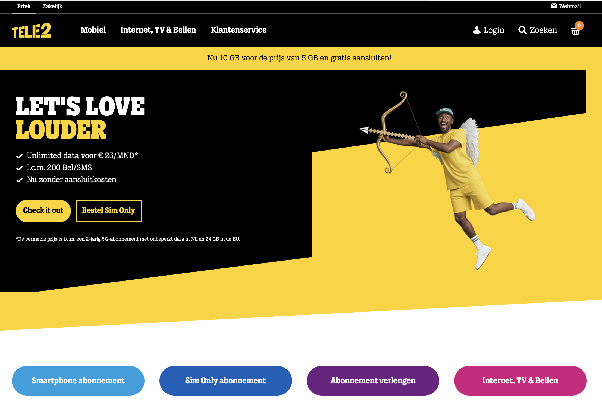
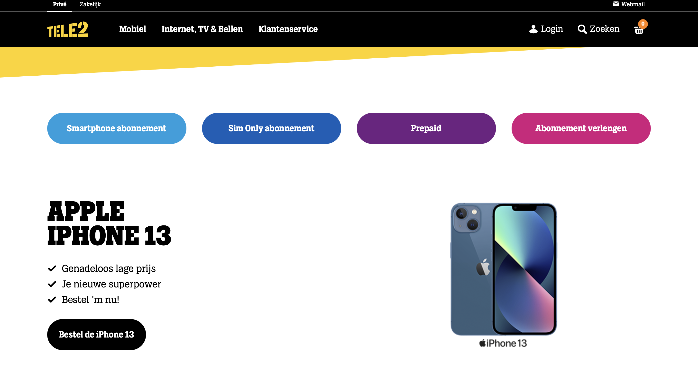

# Procesverslag
Markdown is een simpele manier om HTML te schrijven.  
Markdown cheat cheet: [Hulp bij het schrijven van Markdown](https://github.com/adam-p/markdown-here/wiki/Markdown-Cheatsheet).

Nb. De standaardstructuur en de spartaanse opmaak van de README.md zijn helemaal prima. Het gaat om de inhoud van je procesverslag. Besteedt de tijd voor pracht en praal aan je website.

Nb. Door *open* toe te voegen aan een *details* element kun je deze standaard open zetten. Fijn om dat steeds voor de relevante stuk(ken) te doen.

## Jij

  
uitwerken voor kick-off werkgroep

  ### Auteur:
  Eva van Herpt

  #### Je startniveau:
  Ik kies voor de blauwe piste als startniveau

  #### Je focus:
  Surface 
 

## Je website

  
uitwerken voor kick-off werkgroep

  ### Je opdracht:
  https://www.tele2.nl 

  #### Screenshot(s) van de eerste pagina (small screen): 
  Homepagina  
  

  #### Screenshot(s) van de tweede pagina (small screen):
  Mobielpagina  
  
 

## Toegankelijkheidstest 1/2 (week 1)

  
uitwerken na test in 1e werkgroep

  ### Bevindingen
  Lijst met je bevindingen die in de test naar voren kwamen:

  #### Screenreader
  Hier korte omschrijving (met indien nodig afbeeldingen)

  Hier een omschrijving van hoe het opgelost kan worden (met indien nodig afbeeldingen)

  #### Muis en Toetsenbord 
  Hier korte omschrijving (met indien nodig afbeeldingen)

  Hier een omschrijving van hoe het opgelost kan worden (met indien nodig afbeeldingen)

  #### Motoriek (shocks, elastiekjes)
  Hier korte omschrijving (met indien nodig afbeeldingen)

  Hier een omschrijving van hoe het opgelost kan worden (met indien nodig afbeeldingen)

  #### Visueel (brillen, contrast, kleurenblind, dark/light). 
  Hier korte omschrijving (met indien nodig afbeeldingen)

  Hier een omschrijving van hoe het opgelost kan worden (met indien nodig afbeeldingen)

## Breakdownschets (week 1)

  
uitwerken na afloop 2e werkgroep

  ### de hele pagina: 
  

  ### dynamisch deel (bijv menu): 
  

  ### wellicht nog een dynamisch deel (bijv filter): 
  

## Voortgang 1 (week 2)

  
uitwerken voor 1e voortgang

  ### Stand van zaken
  De opstart van dit vak was bij mij erg moeilijk. Ik weet van mezelf dat dit een kant van de opleiding is die ik totaal niet leuk vind,
  maar wel een uitdaging vind om het te leren. Ik ben begonnen met de breakdownschetsen, zodat ik de verdeling van mijn code makkelijker kon 
  opstellen. Na deze schetsen heb ik een eenvoudige verdeling gemaakt in mijn code en zo heb ik de eerste informatie van de eerste pagina kunnen
  invullen. Hieronder heb ik een screenshot gezet van mijn breakdownschetsen.

  

  ### Agenda voor meeting
  samen met je groepje opstellen

  | student 1      | student 2          | student 3    | student 4        |
  | ---            | ---                | ---          | ---              |
  | dit bespreken  | en dit             | en ik dit    | en dan ik dat    |
  | en dat ook nog | dit als er tijd is | nog een punt | dit wil ik zeker |
  | ...            | ...                | ...          | ...              |

  Vragen : 
  - mijn afbeeldingen staan niet in mijn html, wel in een goede map
  - mag span?
  - afbeeldingen zijn niet zichtbaar
  - class vervangen naar wat?

  ### Verslag van meeting
  hier na afloop snel de uitkomsten van de meeting vastleggen

  - Opstel van de eerste code is goed
  - Breakdownschetsen zijn duidelijk en kunnen helpen bij de code. 
  - Website is veranderd ivm Black Friday, hoe ga ik dit aanpakken?

## Voortgang 2 (week 3)

  
uitwerken voor 2e voortgang

  ### Stand van zaken
  Ik heb deze week echt ontzettend hard gewerkt aan mijn website. Ik heb de eerste pagina zo goed als af gekregen en ben begonnen aan de 
  tweede pagina. Doordat ik zo druk bezig ben met mijn website, merk ik wel dat ik de opdrachten wat minder goed deed. Tijdens de les doe 
  ik actief mee en heb gemerkt dat ik het zo daadwerkelijk ook beter begrijp. 

  ### Agenda voor meeting
  samen met je groepje opstellen

  | student 1      | student 2          | student 3    | student 4        |
  | ---            | ---                | ---          | ---              |
  | dit bespreken  | en dit             | en ik dit    | en dan ik dat    |
  | en dat ook nog | dit als er tijd is | nog een punt | dit wil ik zeker |
  | ...            | ...                | ...          | ...              |

  vragen :
  - slide show, hoe moet dat?
  - hoe werkt de before en after tag?
  - nav bar maken 
  - check marks lukken niet 

  ### Verslag van meeting
  hier na afloop snel de uitkomsten van de meeting vastleggen

  - Ben erg ver met mijn werk
  - before en after tag komt volgende week
  - uitklapmenu in de footer samen gemaakt met Yara
- ...

## Toegankelijkheidstest 2/2 (week 4)

  
uitwerken na test in 8e werkgroep

  ### Bevindingen
  Lijst met je bevindingen die in de test naar voren kwamen (geef ook aan wat er verbeterd is):

  #### Screenreader
  Hier korte omschrijving (met indien nodig afbeeldingen)

  Hier een omschrijving van hoe het opgelost kan worden (met indien nodig afbeeldingen)

  #### Muis en Toetsenbord 
  Hier korte omschrijving (met indien nodig afbeeldingen)

  Hier een omschrijving van hoe het opgelost kan worden (met indien nodig afbeeldingen)

  #### Motoriek (shocks, elastiekjes)
  Hier korte omschrijving (met indien nodig afbeeldingen)

  Hier een omschrijving van hoe het opgelost kan worden (met indien nodig afbeeldingen)

  #### Visueel (brillen, contrast, kleurenblind, dark/light). 
  Hier korte omschrijving (met indien nodig afbeeldingen)

  Hier een omschrijving van hoe het opgelost kan worden (met indien nodig afbeeldingen)

## Voortgang 3 (week 4)

  
uitwerken voor 3e voortgang

  ### Stand van zaken
  hier dit ging goed & dit was lastig (neem ook screenshots op van delen van je website en code)

  ### Agenda voor meeting
  samen met je groepje opstellen

  | student 1      | student 2          | student 3    | student 4        |
  | ---            | ---                | ---          | ---              |
  | dit bespreken  | en dit             | en ik dit    | en dan ik dat    |
  | en dat ook nog | dit als er tijd is | nog een punt | dit wil ik zeker |
  | ...            | ...                | ...          | ...              |

  ### Verslag van meeting
  hier na afloop snel de uitkomsten van de meeting vastleggen

  - punt 1
  - punt 2
  - nog een punt
  - ...

## Eindgesprek (week 5)

  
uitwerken voor eindgesprek

  ### Je uitkomst - karakteristiek screenshots:
  

  ### Dit ging goed/Heb ik geleerd: 
  Korte omschrijving met plaatjes

  

  ### Dit was lastig/Is niet gelukt:
  Korte omschrijving met plaatjes

  

## Bronnenlijst

  
continu bijhouden terwijl je werkt

  Nb. Wees specifiek ('css-tricks' als bron is bijv. niet specifiek genoeg).

  1. https://www.w3schools.com/css/css3_buttons.asp 
  2. https://www.w3schools.com/css/css_rwd_images.asp 
  3. https://developer.mozilla.org/en-US/docs/Web/HTML/Element/details 

